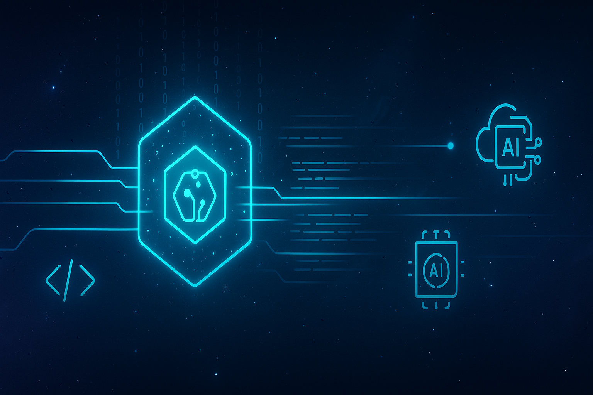

<!-- Banner -->

<h1 align="center">Hi, I'm Duane 👋</h1>
<h3 align="center">Senior Full-Stack Software Engineer (.NET • React • TypeScript) | Atlanta, GA</h3>

  
  
  

---

### 👨‍💻 About Me

- 🏆 Senior software engineer with 15+ years building high-performance web, mobile, and API solutions.
- 🤖 Expert in **.NET 8/C#**, **React 18**, **TypeScript**, and **Azure** — designing microservices, rich UIs, and CI/CD pipelines.
- 👨‍🏫 Led cross-functional teams, mentored engineers, and drove DevOps & cloud adoption.
- 🧠 Hands-on with GitHub Copilot & Azure OpenAI; deliver AI-driven training simulators and recommender systems.

---

### 🛠️ Technical Skills

**Languages:**  
C#, TypeScript, JavaScript, Java, Python, SQL

**Frameworks:**  
.NET 8, ASP.NET Core, React 18, Next.js 14, Angular, Node.js

**Cloud / DevOps:**  
Azure (AKS, Functions, App Service, Cosmos DB), AWS, Docker, Kubernetes, Terraform, GitHub Actions, Azure DevOps

**Architecture:**  
Microservices, Event-Driven, REST, GraphQL, Serverless

**Data & Messaging:**  
SQL Server, PostgreSQL, MongoDB, Redis, Azure Service Bus

**Testing:**  
xUnit, Jest, React Testing Library, Cypress, Playwright, Selenium

**AI/ML:**  
Azure OpenAI, LangChain, Vector Search, Copilot, Transformers

---

### 🚀 Selected Projects

- **Hotel Management Platform:** Next.js 14, React 18, Stripe, Sanity CMS, NextAuth – Full-stack booking platform with secure payments & perfect Lighthouse score.
- **Voyager PWA:** React 18, TypeScript, Firebase – Offline-first travel itinerary app with Cypress E2E and GitHub Actions CI/CD.
- **Creative Portfolio 3D:** Next.js, Three.js – Interactive WebGL portfolio site featuring 3D models and animations.
- **Terraform Azure VM:** Terraform – IaC for secure Azure Linux VM with Docker and policy-compliant networking.
- **AI Book Recommender:** Python 3.11, LangChain, Gradio – Semantic vector search and sentiment-aware book recommendations.

---

### 💼 Professional Experience

**Principal Consultant – Full‑Stack Software Engineer**  
_Slalom | Atlanta, GA (2021–Present)_  
- Built Azure-hosted AI Training Simulator (.NET 8, React 18)
- Automated CI/CD with GitHub Actions & Terraform, enabling zero-downtime releases
- Integrated Azure AD B2C authentication, feature flags, and monitoring
- Mentored 12 engineers, promoted TDD, and presented DORA metrics

**Senior Software Engineer**  
_UKG (Ultimate Software) | Atlanta, GA (2015–2021)_  
- Developed .NET Core REST APIs & Java Spring Boot microservices for HCM platform (5M+ users)
- Built Angular components for payroll dashboards

**Senior Performance & Automation Engineer**  
_VMware AirWatch | Atlanta, GA (2013–2015)_  
- Created distributed load-testing harness simulating 1M devices; reduced production incidents by 40%

---

### 🏆 Quality Engineering & DevOps Leadership

- 🛡️ Automated iOS & Android regression suites, reducing cycle time by 70%
- 🧩 Architected modular automation & performance frameworks for rapid releases
- 📊 Built KPI-driven performance testing harness, boosting customer retention by 10%
- 🚀 Deployed automated quality gates in GitHub Actions, Jenkins, and Azure DevOps
- ☁️ Provisioned scalable QA test environments on Firebase, AWS, and Azure
- 🤖 Scaled Android CI/CD automation, eliminating 80% of manual validation

---

### 🎓 Education

**B.S. in Information Systems**  
Georgia State University, Atlanta, GA

---

### 📈 GitHub Stats

  
  

---

### 🌐 Connect with Me

  <a href="mailto:DuaneQHodges@gmail.com">Email</a> •
  <a href="https://www.linkedin.com/in/duane-hodges-904a3968">LinkedIn</a> •
  <a href="https://duaneq.github.io/NextJs-Portfolio/">Portfolio</a>

---

<!-- Optionally add fun facts, a quote, or a call-to-action here! -->
